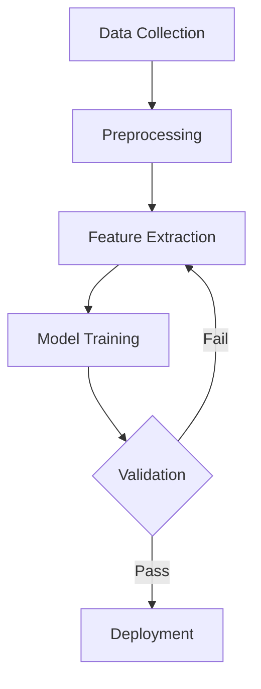
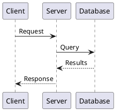

# Scientific Documentation

## LaTeX Essentials

### Document Structure

```latex
\documentclass[11pt,a4paper]{article}

\usepackage{amsmath,amssymb}  % Math
\usepackage{graphicx}         % Images
\usepackage{hyperref}         % Links
\usepackage{booktabs}         % Better tables
\usepackage[backend=biber,style=ieee]{biblatex}

\addbibresource{references.bib}

\title{Your Paper Title}
\author{Author Name \\ \texttt{email@example.com}}
\date{\today}

\begin{document}
\maketitle
\begin{abstract}
Your abstract here.
\end{abstract}

\section{Introduction}
\label{sec:intro}

\section{Methodology}

\section{Results}

\section{Conclusion}

\printbibliography
\end{document}
```

### Mathematical Notation

```latex
% Inline math
The equation $E = mc^2$ describes...

% Display math
\begin{equation}
\label{eq:bayes}
P(A|B) = \frac{P(B|A) \cdot P(A)}{P(B)}
\end{equation}

% Aligned equations
\begin{align}
f(x) &= x^2 + 2x + 1 \\
     &= (x + 1)^2
\end{align}

% Matrices
\begin{pmatrix}
a & b \\
c & d
\end{pmatrix}
```

## Markdown + Extensions

### Mathematical Equations (KaTeX/MathJax)

```markdown
Inline: $E = mc^2$

Block:
$$
\int_{-\infty}^{\infty} e^{-x^2} dx = \sqrt{\pi}
$$
```

### Mermaid Diagrams

```markdown

```

### Tables

```markdown
| Method    | Accuracy | F1 Score | Time (ms) |
|-----------|----------|----------|-----------|
| Baseline  | 0.82     | 0.79     | 12        |
| Proposed  | **0.91** | **0.88** | 15        |
| SOTA      | 0.89     | 0.86     | 45        |
```

## Citation Management

### BibTeX Entry Types

```bibtex
@article{smith2023,
  author  = {Smith, John and Doe, Jane},
  title   = {A Novel Approach to X},
  journal = {Journal of Computing},
  year    = {2023},
  volume  = {42},
  pages   = {1--15},
  doi     = {10.1234/joc.2023.001}
}

@inproceedings{doe2022,
  author    = {Doe, Jane},
  title     = {Conference Paper Title},
  booktitle = {Proceedings of CONF 2022},
  year      = {2022},
  pages     = {100--110}
}

@misc{repo2023,
  author       = {Developer, A},
  title        = {Open Source Project},
  year         = {2023},
  howpublished = {\url{https://github.com/...}},
  note         = {Accessed: 2023-12-01}
}
```

### Citation Commands

```latex
\cite{smith2023}           % [1]
\citet{smith2023}          % Smith et al. [1]
\citep{smith2023}          % [Smith et al., 2023]
\cite{smith2023,doe2022}   % [1, 2]
```

## Diagrams

### PlantUML



### TikZ (LaTeX)

```latex
\begin{tikzpicture}
\node[rectangle,draw] (a) at (0,0) {Input};
\node[rectangle,draw] (b) at (3,0) {Process};
\node[rectangle,draw] (c) at (6,0) {Output};
\draw[->] (a) -- (b);
\draw[->] (b) -- (c);
\end{tikzpicture}
```

## Writing Guidelines

### Structure
1. **Abstract**: Problem, approach, key results (150-300 words)
2. **Introduction**: Context, problem statement, contributions
3. **Related Work**: Prior approaches, gaps
4. **Methodology**: Your approach in detail
5. **Experiments/Results**: Setup, metrics, findings
6. **Discussion**: Interpretation, limitations
7. **Conclusion**: Summary, future work

### Style Tips
- Use active voice: "We propose..." not "It is proposed..."
- Be precise with numbers: "improved by 12%" not "significantly improved"
- Define acronyms on first use
- Use consistent terminology throughout
- Cite primary sources, not reviews

### Common Mistakes
- Overclaiming results
- Missing related work
- Insufficient experimental details
- Poor figure/table captions
- Inconsistent notation
